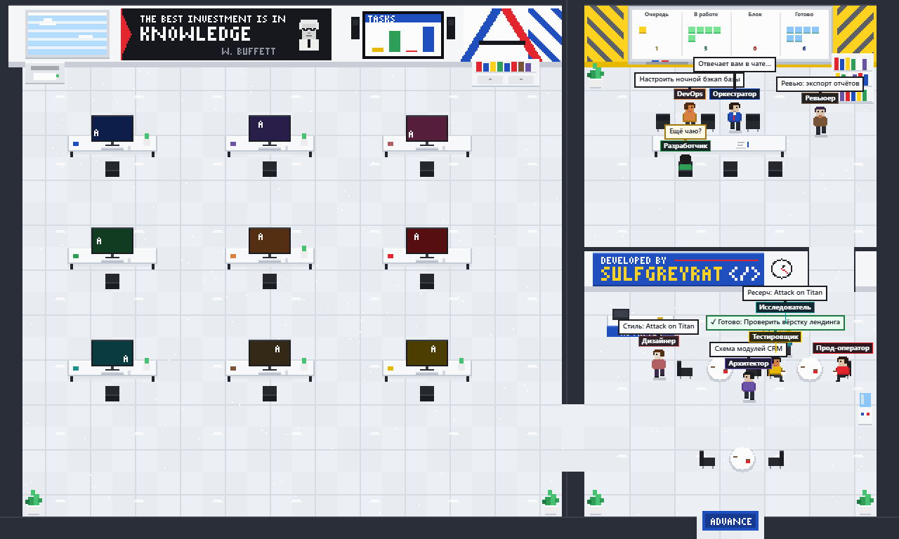
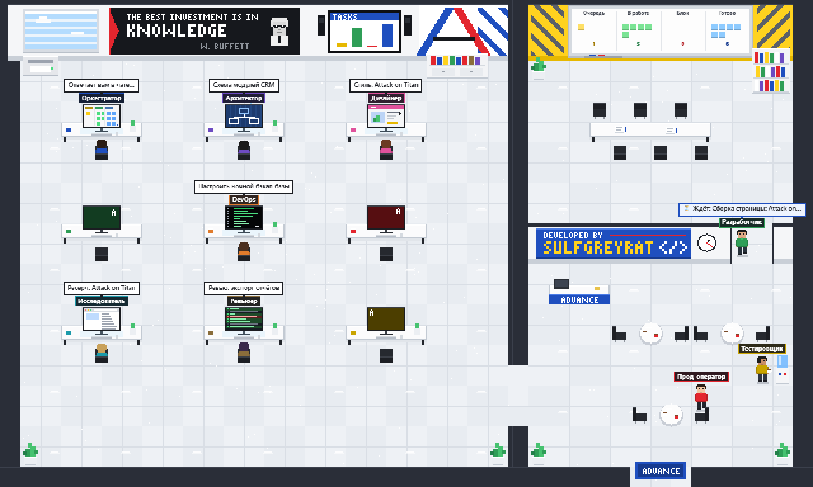
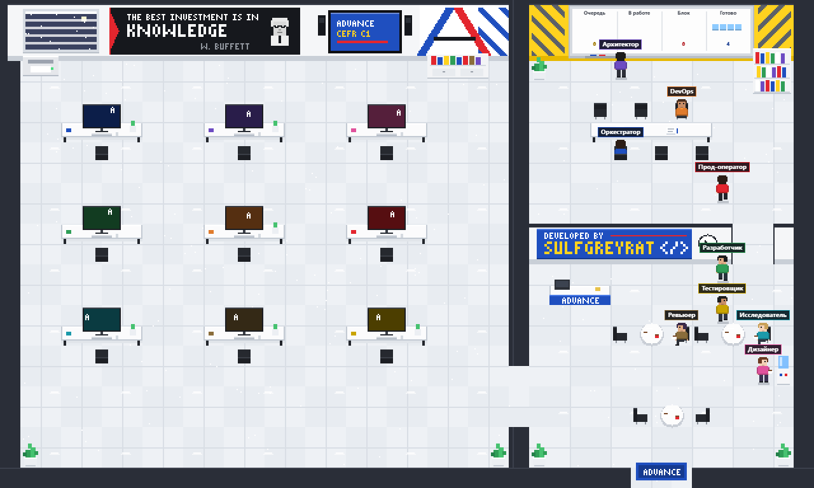
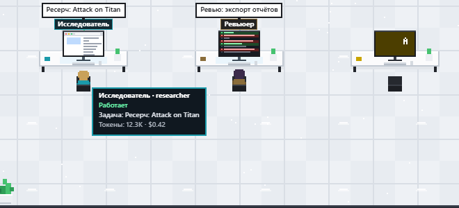

<div align="center">

# SulfGreyrat's office

**Пиксельный офис для агентов [Hermes](https://github.com/NousResearch/hermes-agent) Desktop**

Каждый профиль Hermes — человечек в офисе: работает за своим ПК, пьёт чай в холле
и уходит домой, когда gateway выключен.



[Установка](#установка) · [Команда агентов](#команда-агентов) · [Как дать задачу команде](#как-дать-задачу-команде) · [Как пользоваться](#как-пользоваться) · [Как это устроено](#как-это-устроено)

</div>

> **EN.** A pixel-art office page for Hermes Desktop. Every Hermes profile is a little
> person with its own PC: while working it sits at the desk and the screen shows what kind
> of work it is (code, mockup, tests, terminal, diff…) with the current Kanban task above,
> it drinks tea in the lobby when idle and walks out when the gateway is off. The UI is in
> Russian. Install with `python install.py`, add the 8-agent team with
> `python setup_agents.py`, then restart Hermes Desktop.

## Что внутри

- **У каждого агента свой ПК.** Работающий сидит за ним спиной к вам, и по экрану видно,
  чем он занят: у разработчика бежит код, у дизайнера макет, у тестировщика галочки
  тестов, у DevOps терминал, у ревьюера diff, у исследователя браузер, у архитектора
  схема, у прод-оператора дашборд. Над монитором — название задачи из Kanban или
  «Работает в чате…».
- **Оркестратор** — основной профиль `default` — работает за своим ПК, как все; на его
  экране мини-доска задач. Когда агент свободен, на его мониторе заставка его цвета,
  когда gateway выключен — экран погашен.
- **Переговорная** с живой доской Kanban: очередь, в работе, блок, готово за сегодня.
  Клик по доске открывает Kanban.
- **Холл** с кафе, кулером и ресепшеном: сюда уходят свободные агенты. Они бродят,
  садятся за столики, смотрят на доску и иногда перекидываются фразами.
- Закрыл задачу — над агентом «✓ Готово» и конфетти.
- Окна живут по часам: днём облака, вечером закат, ночью звёзды. Часы на стене
  показывают настоящее время.
- Наведите мышь на человечка — карточка с задачей, токенами и расходами.

Интерьер нарисован по мотивам учебного центра ADVANCE: белые столы, глянцевый пол,
стена «The best investment is in knowledge», красно-синяя «A» и жёлтая переговорная.

## Скриншоты

| Рабочий день | Ночь, все свободны |
|---|---|
|  |  |

Карточка агента при наведении на него или на его монитор:



## Требования

- [Hermes Agent](https://github.com/NousResearch/hermes-agent) и Hermes Desktop 0.20+
  (проверено на 0.20.2, Windows 11). Desktop обязателен — CLI и gateway сами по себе
  десктоп-плагины не загружают.
- Python 3.8+ без дополнительных пакетов (подойдёт python из venv Hermes).
- Чтобы в офисе что-то происходило: запущенный gateway и включённый Kanban
  (см. [Команда агентов](#команда-агентов)).

## Установка

```bash
git clone https://github.com/SulfGreyrat/sulfgreyrat-office.git
cd sulfgreyrat-office
python install.py
```

Скрипт находит папку Hermes (`$HERMES_HOME`, иначе `%LOCALAPPDATA%\hermes` на Windows,
иначе `~/.hermes`), копирует плагин и добавляет `sulfgreyrat-office` в
`plugins.enabled` в `config.yaml` (старый конфиг сохраняется рядом как бэкап):

```
desktop-plugins/sulfgreyrat-office/plugin.js          # страница офиса
plugins/sulfgreyrat-office/dashboard/plugin_api.py    # API /api/plugins/sulfgreyrat-office/state
plugins/sulfgreyrat-office/dashboard/manifest.json
```

Затем **полностью закройте Hermes Desktop** (вместе со значком в трее) и откройте
снова: API плагина подключается только при старте. В боковой панели появится
**SulfGreyrat's office**.

> Windows: если команды `python` нет, используйте python из Hermes:
> `%LOCALAPPDATA%\hermes\hermes-agent\venv\Scripts\python.exe install.py`

## Команда агентов

Офис показывает все профили Hermes, какие у вас есть. Чтобы получить ту же команду
из восьми ролей, что на скриншотах:

```bash
python setup_agents.py --dry-run   # показать, что будет сделано
python setup_agents.py
```

| Профиль | Роль |
|---|---|
| `default` | **Оркестратор** — ваш основной агент, раздаёт задачи |
| `architect` | Архитектор. Разбивает задачу на компоненты, выбирает решения до кода |
| `designer` | Дизайнер. UI/UX, макеты, визуальная консистентность |
| `developer` | Разработчик. Реализует и проверяет код запуском |
| `devops` | DevOps. Инфраструктура, CI/CD, деплой, мониторинг |
| `prod-operator` | Прод. Отдельная граница доверия: ничего автоматически |
| `researcher` | Исследователь. Собирает и сравнивает информацию, не пишет код |
| `reviewer` | Ревьюер. Анализирует код и решения, не переписывает без запроса |
| `tester` | Тестировщик. Запускает и проверяет, фиксирует баги |

Что делает скрипт:

1. Создаёт каждый профиль командой
   `hermes profile create <имя> --clone --description "<роль>"` — это клон активного
   профиля, поэтому у агента сразу есть модель, ключи и скиллы. Если профиль уже есть,
   обновляется только описание. По описаниям оркестратор Kanban решает, кому отдать задачу.
2. Дописывает в `SOUL.md` каждого профиля короткую инструкцию роли (между маркерами —
   повторный запуск ничего не дублирует; `--no-soul`, чтобы пропустить).
3. Закрепляет `default` оркестратором Kanban: `kanban.orchestrator_profile: default`.
4. Включает оркестратору инструменты Kanban (`toolsets: [hermes-cli, kanban]` в
   `config.yaml`) — без этого основной агент не видит `kanban_create` и не может сам
   раздавать задачи. Если у вас уже есть свой список `toolsets`, скрипт его не трогает
   и подскажет добавить `kanban` вручную.

5. Дописывает в `SOUL.md` основного профиля правила оркестратора (см.
   [Как дать задачу команде](#как-дать-задачу-команде)). Папка, куда команда складывает
   результаты: `--projects-dir <путь>`, иначе `terminal.cwd` из `config.yaml`, иначе
   `~/hermes-projects`.

Все изменения конфигов делаются с бэкапом рядом. Флаг `--no-alias` отключает создание
команд-обёрток (`architect`, `tester`, …).

После этого:

- включите **Kanban** в Hermes Desktop: *Settings → Plugins → Kanban*;
- держите **gateway** запущенным (`hermes gateway run` или системный сервис) — в нём
  живёт диспетчер Kanban, который раздаёт задачи агентам.

Модель у всех агентов будет та же, что у основного профиля; поменять её можно в
`config.yaml` конкретного профиля (`<HERMES_HOME>/profiles/<имя>/config.yaml`).

## Как дать задачу команде

Просто напишите основному агенту в чате Desktop или в Telegram, например:

> сделай мне html-страничку с ресерчем по «Атаке титанов», оформленную в стиле этого
> аниме, и побольше картинок

Оркестратор не делает такую работу сам, а раскладывает её на конвейер Kanban в общей
папке проекта:

| Кто | Задача | Результат |
|---|---|---|
| Исследователь | «Ресерч: Attack on Titan» — факты и проверенные ссылки на картинки | `research.md` |
| Дизайнер | «Стиль: Attack on Titan» — палитра, шрифты, мотивы (параллельно с ресерчем) | `style.md` |
| Разработчик | «Сборка страницы: Attack on Titan» — ждёт двух предыдущих, собирает страницу | `index.html` |

В офисе это видно так: Оркестратор за своим ПК (на экране мини-доска задач), потом
исследователь и дизайнер садятся за ПК — у одного браузер, у другого макет, — а
разработчик стоит в холле с пузырём «⏳ Ждёт: Сборка страницы…». Когда они закончат, он
сядет за ПК и начнёт верстать. Результат — `<папка проектов>/<проект>/index.html`.

Вопросы, короткие ответы и мелкие правки Оркестратор делает сам. Если хотите, чтобы он
и крупное сделал сам, так и скажите: «сделай сам». Учтите: каждый агент — отдельная
сессия модели, поэтому командная работа расходует больше токенов, чем один агент.

## Как пользоваться

| В офисе | Что это значит |
|---|---|
| Сидит за своим ПК, на экране идёт работа | Работает прямо сейчас: активная сессия за последние 90 с или задача «В работе» в Kanban |
| Пьёт чай в холле, сидит в переговорной, смотрит на доску; на его мониторе заставка | На смене и свободен: gateway запущен, диспетчер может выдать задачу |
| Свободен, но над головой «⏳ Ждёт: …» или «▶ Сейчас возьмёт: …» | У него есть задача в очереди: ждёт, пока закончат предыдущие, или диспетчер вот-вот её выдаст |
| Никого нет, мониторы погашены | Gateway выключен — все ушли домой |

Чтобы в офисе закипела работа:

- **Kanban** — создайте карточку и назначьте исполнителя. Диспетчер сам посадит агента
  за его ПК, а по завершении над ним появится «✓ Готово».
- **Оркестратор** — напишите основному агенту (в Desktop или в Telegram), что нужно
  сделать, — крупную задачу он сам разложит по команде
  (см. [Как дать задачу команде](#как-дать-задачу-команде)).
- **Чат с профилем** — откройте сессию с нужным профилем, и он сядет работать.

Внизу страницы — счётчики (на смене, работают, очередь, готово сегодня, токены,
расходы), список агентов и эта же справка.

## Как это устроено

- **Фронтенд** — один ESM-файл без сборки и зависимостей (только `@hermes/plugin-sdk` и
  React приложения). Сцена 640×384 «игровых» пикселей рисуется на Canvas 2D и
  масштабируется без сглаживания; подписи и пузыри рисуются поверх в экранном
  разрешении. Агенты ходят по плану этажа поиском пути (BFS), 15 кадров в секунду,
  опрос API раз в 4 секунды и пауза, когда вкладка скрыта.
- **Бэкенд** — FastAPI-роутер `GET /api/plugins/sulfgreyrat-office/state`. Открывает всё
  только на чтение: `gateway_state.json` (жив ли gateway), агрегаты из `state.db`
  каждого профиля (COUNT/SUM/MAX — без текста сообщений) и названия/статусы задач из
  `kanban.db`.
- **Windows** — жив ли процесс, проверяется через `psutil`, а не `os.kill(pid, 0)`: на
  Windows тот не проверяет, а шлёт Ctrl+C группе процесса и может уронить gateway.

## Удаление

```bash
python install.py --remove          # убрать плагин и выключить его бэкенд
hermes profile delete <имя>         # если нужно удалить профили агентов
```

## Разработка

Сцену можно проверить без Hermes: `tests/harness.html` подменяет SDK заглушками и
рисует офис на подставных данных.

```bash
python -m http.server 8765 --bind 127.0.0.1
# открыть http://127.0.0.1:8765/tests/harness.html?s=walk&t=6&hour=13
# s = mix | walk | idle | off | gif,  hover=<профиль>,  hour=<0..23>
python tests/capture.py             # перерисовать картинки в docs/ (нужны Edge и Pillow)
```

## Благодарности

- Интерьер — по мотивам учебного центра ADVANCE.
- Идея и основа бэкенда — [oslook/hermes-desktop-plugin-office-3d](https://github.com/oslook/hermes-desktop-plugin-office-3d) (MIT).

## Лицензия

[MIT](LICENSE) © SulfGreyrat
